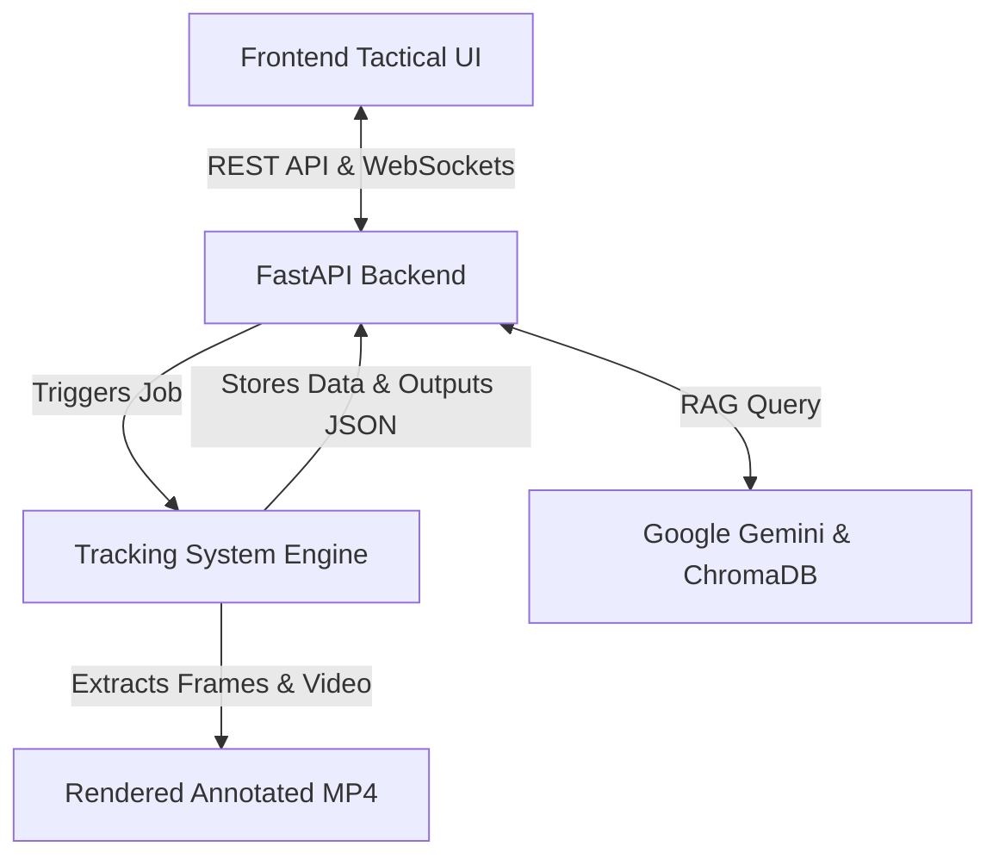
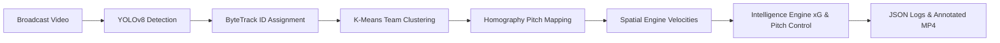

# Synapse AI - Football Tracking & Tactical Engine ⚽🧠

**Synapse AI** is an advanced, full-stack football (soccer) tactical analytics engine. It leverages state-of-the-art computer vision (YOLO), spatial intelligence, and generative AI to automatically transcribe broadcast match footage into 2D tactical maps, derive complex analytics (Expected Goals, Pitch Control, Pass Expected Value), and provide an interactive AI Coaching Assistant for post-match breakdowns.

---

## 🌟 Vision
Democratize elite-level football analytics. Synapse enables amateur clubs, content creators, and scouts to extract multi-million-dollar data points from standard broadcast or drone footage without the need for physical GPS trackers.

## 🚀 Key Features

*   **Automated Tracking System**: Full-match continuous player and ball tracking using YOLOv8/11 and ByteTrack.
*   **Homography & Pitch Mapping**: Warps 2D camera pixel coordinates into mathematically accurate top-down 105m x 68m tactical pitch mappings.
*   **Tactical Intelligence Engine**: 
    *   **Pitch Control**: Calculates territorial dominance dynamically.
    *   **Pass Evaluator**: Computes interception risks and evaluates passing options based on spatial data.
    *   **Expected Goals (xG)**: Calculates goal probability using Logistic Regression trained on StatsBomb open data.
*   **Team Distinction**: Automatic separation of Home and Away teams using K-Means clustering in HSV color space.
*   **AI Coaching Assistant**: A Multi-Agent RAG System powered by Google Gemini and ChromaDB. Ask tactical questions like *"Why did our passing break down around frame 300?"* directly in a chat interface.
*   **"Matchday" UI**: A striking Brutalist web dashboard offering synchronized side-by-side video and 2D pitch tracking playback, live HUD metrics, and manual calibration tools.

## 🏗️ System Architecture

Synapse is decoupled into three primary pillars, working together in a seamless pipeline:



### 1. Computer Vision & Tracking (`tracking_system/`)
The heavy-lifting Python/PyTorch pipeline. Handles object detection, spatial kinematics (via Kalman Filters), homography mapping, and rendering of annotated `.mp4` outputs.

#### 🔎 Tracking Pipeline


### 2. Backend Data & AI Orchestrator (`backend/`)
Built on FastAPI, this acts as the API layer managing asynchronous video processing queues, RESTful endpoints, and WebSocket connections for real-time tracking data and the multi-agent AI chat.

### 3. Frontend Tactical UI (`frontend/`)
A native HTML5/JS/CSS client focusing on striking typography and high contrast. Features an interactive Canvas tool for pitch calibration, dynamic charting, and a synchronized video/tactical view.

## 💻 Tech Stack

*   **AI & Computer Vision**: PyTorch, Ultralytics YOLOv8/11, Scikit-Learn, OpenCV, FilterPy.
*   **Backend & Orchestration**: Python 3, FastAPI, Uvicorn, LangChain, ChromaDB, Google GenAI (Gemini).
*   **Frontend**: HTML5, Vanilla JavaScript, CSS3 (Tailwind primitives), Chart.js.
*   **Video Processing**: Ffmpeg (via `imageio`).

## 🛠️ Getting Started

### Prerequisites
- Python 3.10+
- Ffmpeg installed and in your system PATH

### Installation

1. **Clone the repository**
   ```bash
   git clone https://github.com/Akarsh2555/Football_tracker.git
   cd Football_tracker
   ```

2. **Backend & Tracking System Setup**
   ```bash
   # Create a virtual environment
   python -m venv venv
   
   # Activate virtual environment
   # On Windows:
   venv\Scripts\activate
   # On macOS/Linux:
   source venv/bin/activate
   
   # Install dependencies
   pip install -r requirements.txt
   ```

3. **Environment Variables**
   Create a `.env` file in the root directory and add your API keys:
   ```env
   GEMINI_API_KEY=your_google_gemini_key_here
   ```

4. **Running the Application**
   ```bash
   # Start the FastAPI backend
   cd backend
   uvicorn main:app --reload
   ```
   *Open the frontend by serving the `frontend/` directory (e.g., using VS Code Live Server or python's `http.server`).*

## 🗺️ Roadmap / Future Enhancements

- [ ] **Dynamic Camera Panning**: Implement robust optical flow to recalculate homography points on panning/zooming cameras automatically.
- [ ] **Multi-Camera Stitching**: Fuse tracking inputs from multiple camera angles into a single cohesive global map.
- [ ] **Mobile Companion App**: A React Native app subscribing to live WebSocket analytical feeds for real-time dugout alerts.

## 🤝 Contributing

Contributions are welcome! If you're passionate about sports analytics, computer vision, or frontend UI, please feel free to fork the repository, create a feature branch, and submit a PR.

## 📄 License
This project is open-source. (Update with your specific license if applicable).

